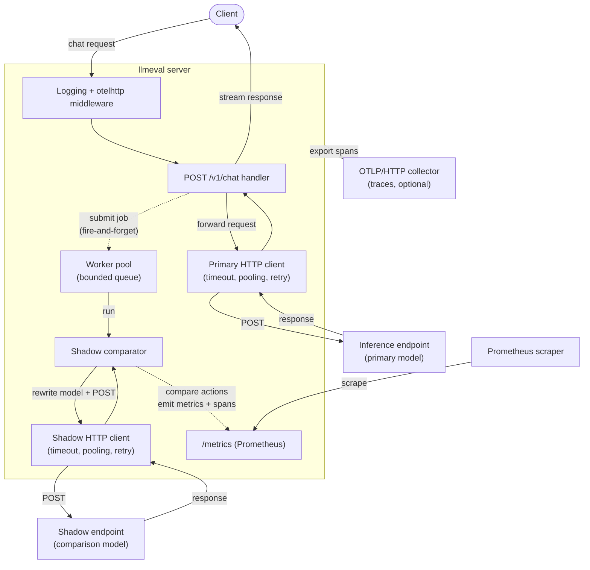

# llmeval

A production-oriented LLM inference proxy in Go. It exposes a chat-completions
endpoint that forwards requests to an upstream model and returns the response to
the caller, while **shadow-evaluating** that response against a second model off
the request path. The shadow programme is fully observable via OpenTelemetry
traces and Prometheus metrics, and it never affects the caller-facing latency or
result.

It uses only the standard library `net/http` for serving, with structured
logging, configuration via viper, tuned outbound HTTP clients with
retry-with-backoff, and a bounded background worker pool that runs comparisons
asynchronously and sheds load when saturated.

## Architecture

The service is built around a clear separation between the **request path**
(what the caller waits on) and the **shadow path** (best-effort background work).

- **`cmd/server`** wires everything together: it loads config, sets up
  telemetry, builds the two outbound HTTP clients, starts the worker pool and
  comparator, constructs the handler, and runs the HTTP server with graceful
  shutdown.
- **`internal/handlers`** owns routing, middleware, and the `/v1/chat` proxy. It
  forwards the request to the inference endpoint via the **primary** client,
  streams the upstream response back to the caller, and then fires a
  fire-and-forget shadow comparison.
- **`internal/clients` (httpx)** provides the shared building blocks for outbound
  calls: a tuned `*http.Client` (timeout + connection pooling), an
  OpenTelemetry-instrumented transport, retry-with-backoff for transient
  failures (429/5xx, honouring `Retry-After`), and typed error decoding.
- **`internal/worker`** is a bounded, in-process goroutine pool fed by a buffered
  queue. Submissions are non-blocking: a full queue sheds the job rather than
  stalling the request path. Jobs recover from panics and each gets its own span.
- **`internal/shadow`** builds and runs a comparison job: it re-sends the
  original request to a **shadow** model (with the `model` field rewritten), then
  answers two questions — (1) did both models return JSON-parsable payloads, and
  (2) do their extracted `action` keys match exactly — recording the outcome as
  metrics and span attributes.
- **`internal/telemetry`** installs a W3C propagator, a pull-based Prometheus
  metrics exporter (served at `/metrics`), and, when an OTLP endpoint is
  configured, an OTLP/HTTP trace exporter. Everything degrades to no-op rather
  than crashing.

### Request & shadow flow



Solid arrows are the synchronous request path the caller waits on; dashed arrows
are the asynchronous shadow/telemetry path that runs after the response has been
returned. If the worker queue is full, the shadow job is dropped (and counted)
rather than delaying the caller.

## Project layout

```
.
├── cmd/
│   └── server/
│       └── main.go            # Entrypoint: wiring, server, graceful shutdown
├── config/
│   ├── config.go              # Typed Config loaded via viper (env + .env)
│   └── config_test.go
├── internal/
│   ├── clients/
│   │   ├── httpx.go           # Outbound HTTP client: pooling, retry, APIError
│   │   └── httpx_test.go
│   ├── handlers/
│   │   ├── handlers.go        # Handler struct, Routes(), /v1/chat proxy, middleware
│   │   └── handlers_test.go
│   ├── logger/
│   │   ├── logger.go          # slog-based structured logger
│   │   └── logger_test.go
│   ├── shadow/
│   │   ├── shadow.go          # Off-path shadow comparison + telemetry
│   │   └── shadow_test.go
│   ├── telemetry/
│   │   ├── telemetry.go       # OpenTelemetry setup (Prometheus + OTLP/HTTP)
│   │   └── telemetry_test.go
│   └── worker/
│       ├── worker.go          # Bounded background goroutine pool
│       └── worker_test.go
├── test/
│   └── integration/           # End-to-end handler tests
├── .do/
│   └── app.yaml               # DigitalOcean App Platform spec (templated)
├── .github/workflows/         # CI/CD pipelines
├── Dockerfile                 # Multi-stage, distroless nonroot
├── .dockerignore
├── .env.example
└── go.mod
```

## Setup

### Prerequisites

- **Go 1.22+** (the service relies on method-based `net/http` routing).
- A **model provider credential** and a reachable **inference endpoint** that
  speaks the OpenAI-style chat-completions API. The defaults target
  DigitalOcean's `https://inference.do-ai.run/v1/chat/completions`.
- _(Optional)_ **Docker** to build/run the container image, and an **OTLP/HTTP
  collector** if you want to export traces.

### 1. Get the code and dependencies

```bash
git clone <your-fork-or-remote-url> llmeval
cd llmeval
go mod download
```

### 2. Configure the environment

Copy the example file and fill in your provider credential:

```bash
cp .env.example .env
```

The service runs with zero configuration thanks to built-in defaults, but the
proxy forwards the caller's `Authorization` header verbatim to the upstream, so
you authenticate per request (see [Usage](#usage) below). Set the values you
need in `.env` — most commonly the upstream URL and models:

```bash
# .env
INFERENCE_ENDPOINT=https://inference.do-ai.run/v1/chat/completions
SHADOW_ENDPOINT=https://inference.do-ai.run/v1/chat/completions
SHADOW_MODEL=alibaba-qwen3-32b
LOG_LEVEL=debug
```

Every knob and its default is documented in [Configuration](#configuration).
Real environment variables always win over `.env`, so you can override any value
inline (e.g. `PORT=8080 go run ./cmd/server`).

### 3. Run the server

```bash
go run ./cmd/server
```

You should see a structured `starting server` log line with the bind address
(default `0.0.0.0:9090`). Confirm it is healthy:

```bash
curl -s http://localhost:9090/health | jq
```

```json
{ "status": "ok", "env": "development", "time": "2026-07-18T08:34:12Z" }
```

## Configuration

Configuration is read from real environment variables, with an optional `.env`
file as a fallback (a missing file is not an error). **Environment variables
take precedence over the `.env` file.**

### Core

| Variable          | Default       | Description                                  |
| ----------------- | ------------- | -------------------------------------------- |
| `APP_ENV`         | `development` | Environment; `production` enables JSON logs. |
| `HOST`            | `0.0.0.0`     | Bind host.                                    |
| `PORT`            | `9090`        | Bind port.                                   |
| `LOG_LEVEL`       | `info`        | `debug` \| `info` \| `warn` \| `error`.      |
| `SERVICE_NAME`    | `llmeval`     | Service name (OTel resource attribute).      |
| `SERVICE_VERSION` | `dev`         | Service version (OTel resource attribute).   |
| `MODEL_ACCESS_KEY`| _(none)_      | Secret credential for the model provider. Never commit it. |
| `INFERENCE_ENDPOINT` | `https://inference.do-ai.run/v1/chat/completions` | Upstream chat-completions URL `/v1/chat` proxies to. |

### Shadow evaluation & worker pool

| Variable                  | Default          | Description                                          |
| ------------------------- | ---------------- | --------------------------------------------------- |
| `SHADOW_MODEL`            | `alibaba-qwen3-32b` | Model substituted into the request body for the shadow call. Empty reuses the caller's model. |
| `SHADOW_ENDPOINT`         | `https://inference.do-ai.run/v1/chat/completions` | Chat-completions URL for the shadow call. Empty falls back to `INFERENCE_ENDPOINT`. |
| `WORKER_COUNT`            | `4`              | Number of background worker goroutines.             |
| `WORKER_QUEUE_SIZE`       | `64`             | Buffered queue depth; submissions are dropped (load shed) when full. |
| `WORKER_SHUTDOWN_TIMEOUT` | `5s`             | How long graceful shutdown waits for in-flight/queued jobs to drain. |

### Outbound HTTP clients

The primary and shadow clients are tuned independently. Durations accept Go
duration strings (e.g. `"30s"`, `"90s"`).

| Variable                            | Default | Description                                |
| ----------------------------------- | ------- | ------------------------------------------ |
| `PRIMARY_TIMEOUT`                   | `30s`   | Whole-request timeout for the primary client. |
| `PRIMARY_MAX_IDLE_CONNS`            | `100`   | Idle (keep-alive) connections across all hosts. |
| `PRIMARY_MAX_IDLE_CONNS_PER_HOST`   | `10`    | Idle connections per destination host.     |
| `PRIMARY_IDLE_CONN_TIMEOUT`         | `90s`   | How long an idle connection is kept.       |
| `SHADOW_TIMEOUT`                    | `30s`   | Whole-request timeout for the shadow client. |
| `SHADOW_MAX_IDLE_CONNS`             | `100`   | Idle connections across all hosts.         |
| `SHADOW_MAX_IDLE_CONNS_PER_HOST`    | `10`    | Idle connections per destination host.     |
| `SHADOW_IDLE_CONN_TIMEOUT`          | `90s`   | How long an idle connection is kept.       |

### HTTP server timeouts

| Variable               | Default | Description             |
| ---------------------- | ------- | ----------------------- |
| `SERVER_READ_TIMEOUT`  | `30s`   | Server read timeout.    |
| `SERVER_WRITE_TIMEOUT` | `30s`   | Server write timeout.   |
| `SERVER_IDLE_TIMEOUT`  | `60s`   | Server idle timeout.    |

Copy `.env.example` to `.env` to get started:

```bash
cp .env.example .env
```

## Endpoints

| Method | Path       | Description                                                       |
| ------ | ---------- | ---------------------------------------------------------------- |
| `GET`  | `/`        | Welcome message (JSON).                                           |
| `GET`  | `/health`  | Health status, current env, and UTC RFC3339 time.                |
| `POST` | `/v1/chat` | Proxies the body to the inference endpoint and returns the upstream response, then shadow-evaluates it off-path. |
| `GET`  | `/metrics` | Prometheus exposition endpoint (served outside the traced router). |

Application routes are registered using Go 1.22+ method-based routing. Every
request passes through a request-logging middleware (method, path, status,
latency, remote_addr) and an `otelhttp` handler that emits a server span and the
standard HTTP server metrics. The `/metrics` endpoint is mounted outside that
router so collector scrapes don't generate spans or request-log noise.

## Usage

The examples below assume the server is running locally on the default port
(`9090`). The proxy forwards your headers verbatim to the upstream, so the
`Authorization` header you send is what authenticates the call against the model
provider — the server does not inject a credential for you.

### 1. Check the server is up

```bash
curl -s http://localhost:9090/health | jq
```

```json
{ "status": "ok", "env": "development", "time": "2026-07-18T08:34:12Z" }
```

### 2. Send a chat-completions request

`POST /v1/chat` takes an OpenAI-style chat-completions body and proxies it to the
configured `INFERENCE_ENDPOINT`. Pass your provider token as a bearer token:

```bash
curl -s http://localhost:9090/v1/chat \
  -H "Content-Type: application/json" \
  -H "Authorization: Bearer $MODEL_ACCESS_KEY" \
  -d '{
    "model": "openai-gpt-5.6-terra",
    "messages": [
      {"role": "user", "content": "What is the capital of France?"}
    ],
    "max_tokens": 100
  }' | jq
```

The upstream response (status code, `Content-Type`, and body) is returned to you
**verbatim** — llmeval does not reshape it:

```json
{
  "id": "chatcmpl-abc",
  "object": "chat.completion",
  "choices": [
    { "index": 0, "message": { "role": "assistant", "content": "Paris." } }
  ]
}
```

As soon as that response is written, the handler fires a **fire-and-forget**
shadow comparison against `SHADOW_MODEL` off the request path. You never wait on
it, and it can never change the bytes you just received.

### 3. Observe the shadow programme

The shadow comparison runs in the background, so watch its effect through
metrics rather than the response. Scrape the Prometheus endpoint after sending a
few requests:

```bash
curl -s http://localhost:9090/metrics | grep '^shadow_'
```

```text
shadow_requests_total 3
shadow_success_total 3
shadow_actions_comparisons_total{match="true"} 2
shadow_actions_comparisons_total{match="false"} 1
```

A mismatch (`match="false"`) means the primary and shadow models disagreed on
the extracted `action` key; a full worker queue shows up as
`shadow_dropped_total`. See [Shadow metrics](#shadow-metrics) for the full list.

### Error responses

The proxy distinguishes upstream errors from gateway failures:

| Scenario                                             | Response                                             |
| ---------------------------------------------------- | ---------------------------------------------------- |
| Malformed request body                               | `400` `{"error":"invalid request body"}`             |
| Upstream returned a non-2xx (after retries for 429/5xx) | The upstream status + body, forwarded verbatim    |
| Transport failure / timeout / cancellation           | `502` `{"error":"upstream request failed"}`          |

## Telemetry

OpenTelemetry is split into a **pull-based** metrics path and a **push-based**
traces path.

- **Metrics** use a Prometheus exporter and are always enabled: they make no
  outbound connections and are exposed at `/metrics` for a collector to scrape.
  A composite W3C `tracecontext` + `baggage` propagator and Go runtime metrics
  are also installed.
- **Traces** are driven by the standard `OTEL_*` environment variables. When an
  OTLP endpoint is set (`OTEL_EXPORTER_OTLP_ENDPOINT` or
  `OTEL_EXPORTER_OTLP_TRACES_ENDPOINT`), a global tracer provider with a batched
  OTLP/HTTP exporter is installed; otherwise a no-op tracer is used and no
  network connections are made.

The service is reported via the `service.name`, `service.version`, and
`deployment.environment.name` resource attributes. Any exporter that fails to
build downgrades to no-op with a warning; telemetry never crashes the app, and
it is flushed during graceful shutdown.

### Shadow metrics

The shadow programme emits dedicated counters so it can be monitored without
touching the caller-facing path:

| Metric                             | Description                                                        |
| ---------------------------------- | ----------------------------------------------------------------- |
| `shadow.requests.total`            | Chat requests shadowed against the comparison model.              |
| `shadow.success.total`             | Shadow calls that returned a JSON-parsable payload and were compared. |
| `shadow.failure.total`             | Failed comparisons, labelled by `reason` (`timeout`, `request_error`, `shadow_status`, `primary_unparsable`, `shadow_unparsable`). |
| `shadow.timeout.total`             | Shadow requests that failed due to a deadline/timeout.           |
| `shadow.actions.comparisons.total` | Action-key comparisons, labelled by `match=true` \| `false`.      |
| `shadow.dropped.total`             | Comparisons shed without running because the worker queue was full. |

## Bounding the memory footprint under load

The service is designed so that a spike in traffic cannot translate into
unbounded memory growth. Instead of queuing everything and hoping to catch up,
it caps every place where work (and therefore memory) can accumulate and sheds
the excess. The result is a footprint that scales with a handful of fixed
configuration values rather than with the incoming request rate.

**1. A bounded, non-blocking shadow queue.** The background pool is a buffered
channel of depth `WORKER_QUEUE_SIZE` (default `64`) drained by exactly
`WORKER_COUNT` goroutines (default `4`). Submission is non-blocking: if the
queue is full, the job is dropped and counted (`shadow.dropped.total`) rather
than buffered.

```80:90:internal/worker/worker.go
// Submit enqueues a job without blocking. It returns false immediately if the
// queue is full, letting the caller shed load (e.g. respond 503) rather than
// stall the request path.
func (p *Pool) Submit(job Job) bool {
	select {
	case p.jobs <- job:
		return true
	default:
		return false
	}
}
```

This means the number of in-flight shadow comparisons — and the request bodies,
headers, and primary payloads they hold alive — is capped at roughly
`WORKER_QUEUE_SIZE + WORKER_COUNT`, regardless of how fast requests arrive.

**2. The request path never blocks on the shadow path.** Because the caller's
response is written before the comparison is enqueued, and enqueueing is
non-blocking, a backlog in the shadow subsystem sheds load instead of applying
back-pressure that would pile up in-flight requests (and their buffers) in the
server.

**3. Capped per-comparison buffers.** Shadow response bodies are read through an
`io.LimitReader` capped at `maxPayloadBytes` (1 MiB), so a single misbehaving or
unexpectedly huge upstream body cannot force a large allocation. Upstream error
bodies are similarly truncated to a few KiB before being copied into an
`APIError`.

```45:47:internal/shadow/shadow.go
	// maxPayloadBytes caps how much of the shadow response we buffer for
	// parsing, protecting against an unexpectedly huge upstream body.
	maxPayloadBytes = 1 << 20 // 1 MiB
```

**4. Bounded outbound connection pools.** Each outbound client is built with a
tuned transport (`MaxIdleConns`, `MaxIdleConnsPerHost`, `IdleConnTimeout`), so
the number of idle sockets — and their read/write buffers — is capped and idle
connections are reclaimed rather than lingering indefinitely.

**5. Timeouts everywhere.** Every outbound request has a whole-request timeout
(`PRIMARY_TIMEOUT` / `SHADOW_TIMEOUT`) and the HTTP server enforces
read/write/idle timeouts. Nothing can hold a goroutine — and the buffers it
references — open forever, which is the usual root cause of slow memory creep
under sustained load.

**6. Graceful, bounded drain on shutdown.** On `SIGINT`/`SIGTERM` the pool stops
accepting work and drains within `WORKER_SHUTDOWN_TIMEOUT`; anything still
queued past that deadline is abandoned rather than keeping the process (and its
memory) alive.

### Tuning the ceiling

The steady-state ceiling is a function of the values you set, so you can size it
to the memory you're willing to spend:

- **Lower** `WORKER_QUEUE_SIZE` / `WORKER_COUNT` to tighten the cap on
  concurrently retained comparisons (fewer bodies held in memory, more
  aggressive shedding).
- **Lower** `SHADOW_TIMEOUT` so slow shadow calls release their buffers sooner.
- **Lower** the `*_MAX_IDLE_CONNS*` values to keep fewer idle sockets around.

Watch `shadow.dropped.total` climb as you tighten these: a rising drop count is
the signal that you are trading shadow coverage for a smaller, more predictable
footprint.

## Running

```bash
# Run directly
go run ./cmd/server

# Build a binary
go build -o bin/server ./cmd/server
./bin/server
```

The server starts in a goroutine and shuts down gracefully on `SIGINT` /
`SIGTERM` with a 10s timeout, after which telemetry is flushed within the same
window. Read/write/idle timeouts are configured on the HTTP server.

## Testing

```bash
go test ./...
go test -race ./...
```

## Docker

```bash
docker build -t llmeval:local .
docker run --rm -p 9090:9090 llmeval:local
```

The image is a statically-linked binary (`CGO_ENABLED=0`, `-trimpath`,
`-ldflags="-s -w"`) on a distroless nonroot base.

## Deployment flow

CI/CD is implemented with GitHub Actions and DigitalOcean.

- **`ci.yml`** — On pull requests to `main` touching Go files: checks `gofmt`,
  verifies `go mod tidy` is clean, runs `go vet`, `golangci-lint`, and
  `go test -race`.
- **`cd-build.yml`** — On push/merge to `main`: builds the image and pushes it
  to DigitalOcean Container Registry (DOCR) tagged with the commit SHA. No
  deploy.
- **`cd-retag.yml`** — On pushing a `v*` git tag: waits for the commit-SHA image
  to exist, then uses `crane tag` to alias the release tag onto that exact image
  digest in DOCR (no rebuild, no deploy).
- **`cd-deploy.yml`** — Manual `workflow_dispatch` taking a release tag (or a raw
  `sha` escape hatch that takes precedence): verifies the image exists in DOCR,
  then deploys to DigitalOcean App Platform using the templated `.do/app.yaml`
  (with `${IMAGE_TAG}` substituted). It targets the `production` environment so
  a Required Reviewer gates the deploy, and uses a `deploy-production`
  concurrency group that never cancels an in-flight deploy.

### Required repository configuration

- **Secret** `DIGITALOCEAN_ACCESS_TOKEN` — DigitalOcean API token.
- **Variable** `DOCR_REGISTRY` — DOCR registry name.
- **Variable** `DO_APP_ID` — (optional) existing App Platform app ID; if unset,
  a new app is created on first deploy.
- **Environment** `production` — configure a Required Reviewer to gate deploys.
